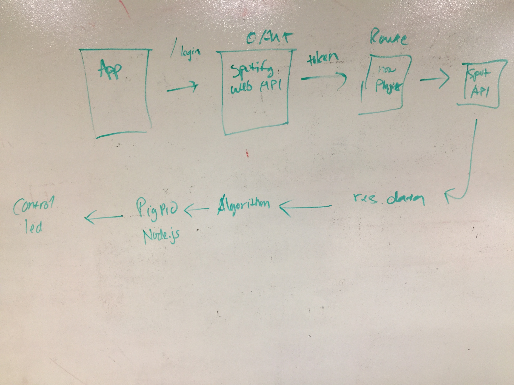

# Code Fellows - Code 401 Midtern Project

## Audio-Color

### Authors: Adrienne Easton, Alvian Joseph, Jeremy Lee, Brad Smialek

### Links and Resources
* [submission PR](http://xyz.com)
* [travis](http://xyz.com)
* [back-end](http://xyz.com)

#### Documentation
* [Spotify api docs](https://developer.spotify.com/documentation/web-api/) 
* [jsdoc](http://xyz.com) (Server assignments)

### Modules
#### `index.js`
##### Exported Values and Methods

#### `server.js`
##### Exported Values and Methods

#### `apiRouter.js`
##### Exported Values and Methods

#### `rgb.js`
##### Exported Values and Methods

### Setup
#### `.env` requirements
* `PORT` - 3000
* `SPOTIFY_CLIENT_ID`
* `SPOTIFY_CLIENT_SECRET`

#### Running the app
* entry point - `index.js`
* `npm start`
* node index.js
* choose song on spotify
* localhost:3000/colorize 
  
#### Tests
* `npm test` to run
* The home route can be accessed
* A token will be given upon hitting the login of the OAUTH route
* Can return currently playing track
* The server can be accessed
* The colorized route can be accessed
* Range function works
* Can valdiate parameters

#### UML
